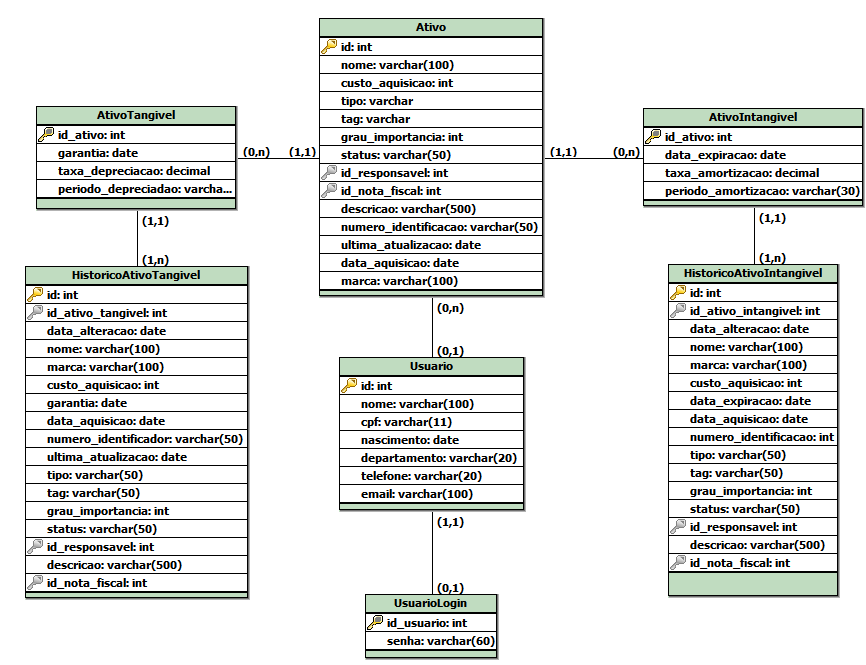

# API_3_BD
Referente ao Banco de Dados da API do terceiro semestre da FATEC

# Modelo

# Diretórios

* `./modelo` - Arquivos do modelo de dados
* `./sql` - Arquivos .SQL com o código do banco
    * `/functions` - Arquivos .SQL com as funções do banco
    * `/procedures` - Arquivos .SQL com as procedures do banco
    * `/tables` - Arquivos .SQL para a criação das tabelas
    * `/triggers` - Arquivos .SQL com os triggers do banco

# Dicionário de Dados

Ativo

| Colunas | Tipo de dados | Comprimento | Restrições | Valor padrão | Descrição |
|:-:|:-:|:-:|:-:|:-:|:-:|
| id | INT | Default | PK, NOT NULL | IDENTITY | Número de identificação do ativo |
| nome | VARCHAR | 100 | NOT NULL | N/A | Nome do ativo |
| custo_aquisicao | INT | Default | N/A | N/A | Custo da aquisição do ativo |
| tipo | VARCHAR | 20 | NOT NULL | N/A | Tipo do ativo |
| tag | VARCHAR | 20 | NOT NULL | N/A | Tag do ativo |
| grau_importancia | INT | Default | N/A | N/A | Grau de importância do ativo |
| status_ativo | VARCHAR | 50 | N/A | N/A | Status do ativo |
| id_responsavel | INT | Default | FK | N/A | Id do usuário responsável pelo ativo |
| id_nota_fiscal | INT | Default | FK | N/A | Id da nota fiscal do ativo |
| descricao | VARCHAR | 500 | N/A | N/A | Descrição do ativo |
| ultima_atualizacao | DATE | Default | N/A | N/A | Última data em que o ativo foi atualizado |
| data_aquisicao | DATE | Default | N/A | N/A | Data de aquisição do ativo |
| marca | VARCHAR | 100 | N/A | N/A | Marca do ativo |

AtivoTangivel

| Colunas | Tipo de dados | Comprimento | Restrições | Valor padrão | Descrição |
|:-:|:-:|:-:|:-:|:-:|:-:|
| id_ativo | INT | Default | PK, FK, NOT NULL | N/A | Número de identificação do ativo |
| garantia | DATE | Default | N/A | N/A | Data de expiração da garantia do ativo |
| taxa_depreciacao | DECIMAL | Default | N/A | N/A | Taxa de depreciação no período |
| periodo_depreciacao | VARCHAR | 30 | N/A | N/A | Período em que ocorre a depreciação |

AtivoIntangivel

| Colunas | Tipo de dados | Comprimento | Restrições | Valor padrão | Descrição |
|:-:|:-:|:-:|:-:|:-:|:-:|
| id_ativo | INT | Default | PK, FK, NOT NULL | N/A | Número de identificação do ativo |
| data_expiracao | DATE | Default | N/A | N/A | Data de expiração do ativo |
| taxa_amortizacao | DECIMAL | Default | N/A | N/A | Taxa de amortização no período |
| periodo_amortizacao | VARCHAR | 30 | N/A | N/A | Período em que ocorre a amortização |

Usuario

| Colunas | Tipo de dados | Comprimento | Restrições | Valor padrão | Descrição |
|:-:|:-:|:-:|:-:|:-:|:-:|
| id | INT | Default | PK, NOT NULL | SERIAL | Número de identificação do usuário |
| nome | VARCHAR | 100 | N/A | N/A | Nome do usuário |
| cpf | VARCHAR | 11 | N/A | N/A | Número de CPF do usuário |
| nascimento | DATE | Default | N/A | N/A | Data de nascimento do usuário |
| departamento | VARCHAR | 20 | N/A | N/A | Departamento do usuário |
| telefone | VARCHAR | 20 | N/A | N/A | Número de telefone do usuário |
| email | VARCHAR | 100 | N/A | N/A | Email do usuário |

UsuarioLogin

| Colunas | Tipo de dados | Comprimento | Restrições | Valor padrão | Descrição |
|:-:|:-:|:-:|:-:|:-:|:-:|
| id | INT | Default | PK, FK, NOT NULL | SERIAL | Número de identificação do usuário |
| senha | VARCHAR | 60 | N/A | N/A | Email do usuário |

